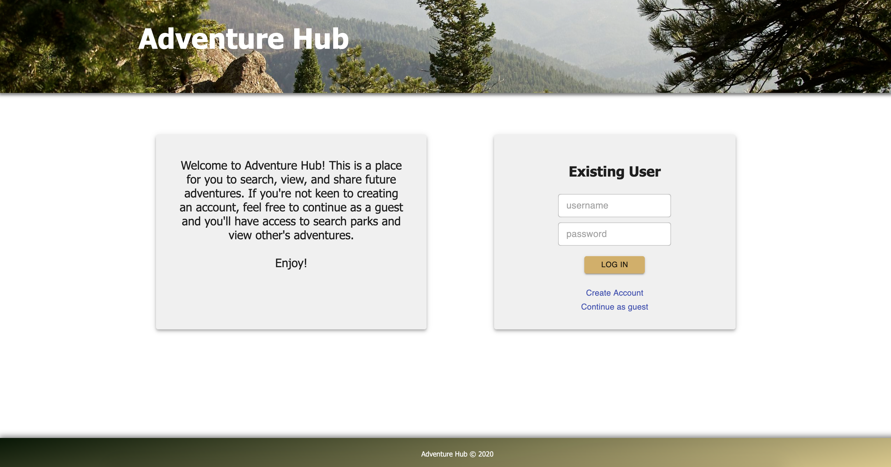
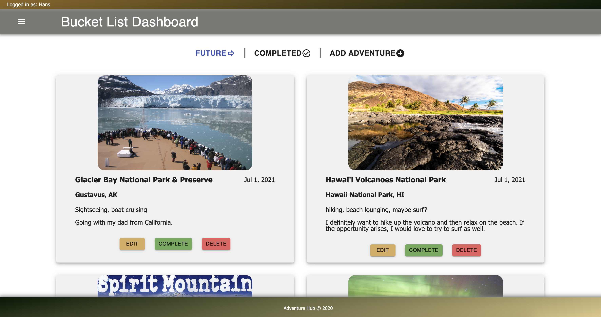
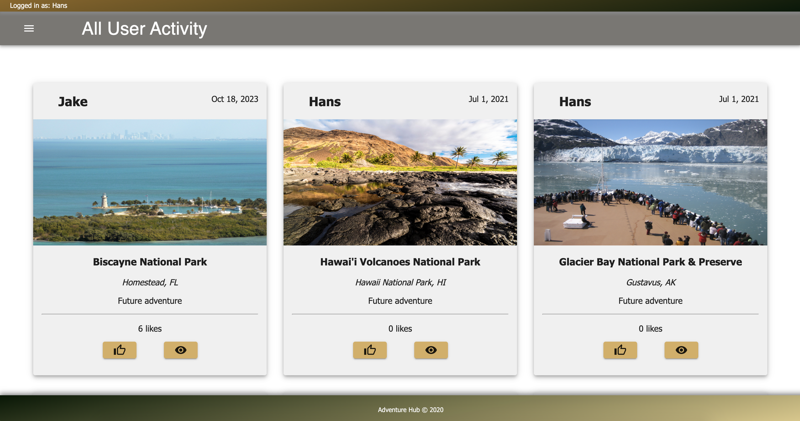

# Adventure Hub

_Duration: 2 week sprint_

A few of my favorite things to do are hiking, biking, camping, and traveling. I'm also a huge planner, so I love making lists, specifically lists of adventures I want to go on. I realized that there was a problem with these lists I was making in my phone. They were crammed, unorganized, and not easy to read. Therefore, this sparked the idea of Adventure Hub.

Adventure Hub is a social media application where users can keep organized bucket lists of future and completed adventures. Once a future adventure has been completed, a user can edit that adventure's pictures, description, and additional information with the click of a button. There are two other main features I integrated into this application. The first being a user activity page, where a user can see all the adventures of other users and drop a like if they think it's cool. Secondly, I implimented a national state park search feature to search for parks by state. Here a user can find a park that they like and directly add it as an upcoming future adventure.

## Screen Shots

This is where a user logs in.

This is the dashboard page. Here is where a user will keep track of their bucket list adventures.

This is the user activity page. Here a user can view all other user's activities.

This is the national park search page. Here a user can search for a national park based on a state.

### Prerequisites

Before you get started, make sure you have the following software installed on your computer:

- [Node.js](https://nodejs.org/en/)
- [PostrgeSQL](https://www.postgresql.org/)
- [Nodemon](https://nodemon.io/)

## Installation

1. Create a database named `adventure_hub`.
2. The queries in the `data.sql` file are set up to create all the necessary tables and populate the needed data to allow the application to run correctly. The project is built on [Postgres](https://www.postgresql.org/download/), so you will need to make sure to have that installed. We recommend using Postico to run those queries as that was used to create the queries.
3. Open up your editor of choice and run an `npm install`.
4. Run `npm run server` in your terminal.
5. Run `npm run client` in your terminal.
6. The `npm run client` command will open up a new browser tab for you!

## Usage

1. Starting on the home page, you can either continue as a guest, create an account, or login with an existing username and password.
2. Once logged in you'll go to the Bucket List Dashboard page. Here you can create a future or completed adventure.
   You can also edit adventures or mark a future adventure as complete, which will mark it as a completed adventure.
3. If you click the hamburger menu in the top left corner you have an option of going to the User Activity page or the Park Search page.
4. In the User Activity page you will see all adventures from every user. Here you can click more details and "like" an adventure.
5. In the Park Search page you can select a state from the dropdown to initiate your search. In return you will get a list of all the national parks in that
   state. You can click more details, and if you like that park you can add it directly to your bucket list as a new future adventure.

## Technologies used

* React.js
* Redux-Sagas
* Material UI
* CSS
* Moment.js
* Node.js
* Express
* PostgreSQL
* National Park Search API

## Acknowledgement

Thanks to [Prime Digital Academy](https://www.primeacademy.io) who equipped and helped me to make this application a reality. Also huge thanks to my cohort Rabin and my family!

## Support

If you have suggestions or issues, please email me at hansjaccola@gmail.com
